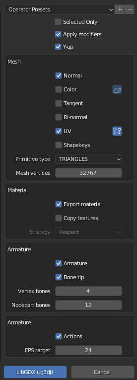

# Overview
Export Blender scene to the native LibGDX model format.

The demo folder contains the LibGDX project with examples.

## Features
- Blender versions 2.83 - 3.6
- Vertex attributes customization
- Infinity number of vertices/indices (until your ram)
- Bake bone animations (any non-linear curves will be baked)
- Binary encoding
- Y-up

# Installation
1. [Download](https://github.com/haz00/blender-g3d-exporter/releases/latest)
2. Blender: Preferences - Addons - Install
3. Do not forget to enable checkbox
4. File - Export - .g3dj/.g3db
5. Follow addon settings

     
    <em>v0.8</em>

# Useful links
[LibGDX Model user guide](https://libgdx.com/wiki/graphics/3d/quick-start)

[G3D Specification](https://github.com/libgdx/fbx-conv/wiki/Version-0.1-%28libgdx-0.9.9%29)

For Blender developers
[1](https://docs.blender.org/api/current/info_quickstart.html) 
[2](https://docs.blender.org/api/current/info_tips_and_tricks.html#executing-modules)
[3](https://docs.blender.org/manual/en/latest/advanced/scripting/index.html)

# License
GNU GPLv3 [LICENSE](https://github.com/haz00/blender-g3d-exporter/blob/master/LICENSE)

blender-g3d-exporter Copyright (C) 2022 haz00 (haz00ku@gmail.com)

# Credits
[simpleubjson](https://github.com/brainwater/simpleubjson)

Binary encoding based on part of [other addon](https://github.com/Dancovich/libgdx_blender_g3d_exporter)
